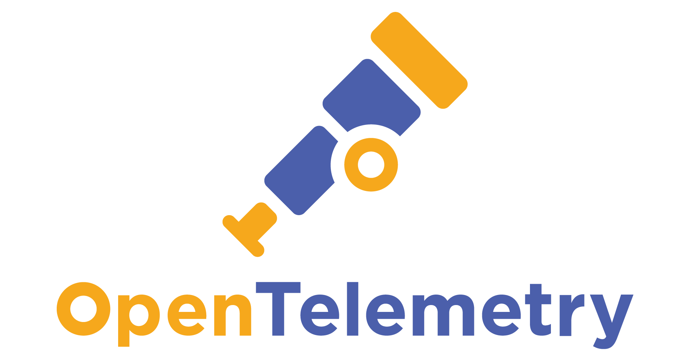
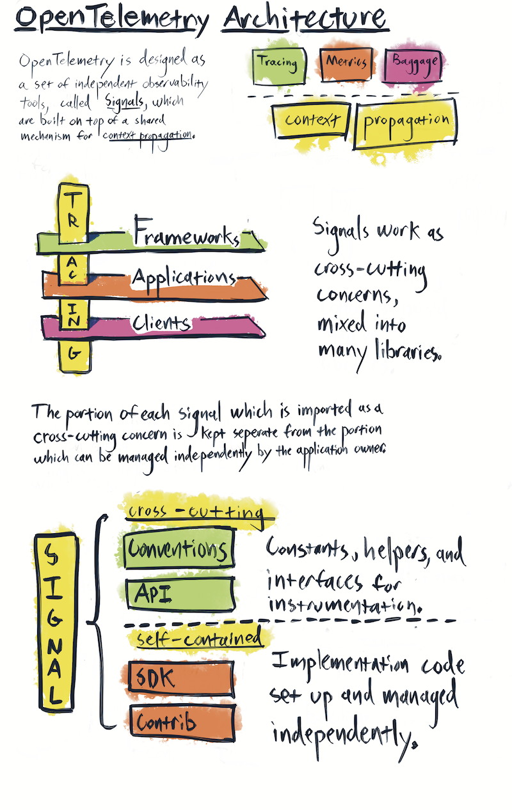
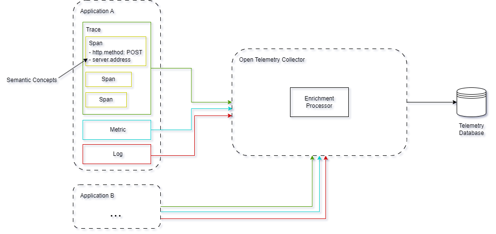

# OpenTelemetry in Microservices



*[Wouter Gosseling, oktober 2024.](https://github.com/hanaim-devops/devops-blog-Woutuhr)*

- [OpenTelemetry in Microservices](#opentelemetry-in-microservices)
  - [The basics](#the-basics)
  - [An overview](#an-overview)
    - [Signals, a deeper dive](#signals-a-deeper-dive)
      - [Traces](#traces)
    - [Samenwerking](#samenwerking)
  - [How do they do it](#how-do-they-do-it)
    - [Setting up](#setting-up)
    - [Tracing toevoegen](#tracing-toevoegen)
  - [Best practices](#best-practices)
  - [Conclusie](#conclusie)
  - [Bronnen](#bronnen)

<hr/>

## The basics

OpenTelemetry (ook bekend als OTel) verzamelt data zoals traces, logs en metrics van je applicaties en services. Deze informatie geeft inzicht in hoe je systeem presteert, waar problemen optreden, en helpt bij het opsporen van bottlenecks of fouten. Hierdoor kun je makkelijker en sneller problemen oplossen.

```text
"A major goal of OpenTelemetry is that you can easily instrument your applications or systems, no matter their language, infrastructure, or runtime environment. The storage and visualization of telemetry is intentionally left to other tools."
(OpenTelemetry, 2024)
```

De bovenstaande quote laat zien dat OpenTelemetry ontworpen is om observability makkelijk en universeel toepasbaar te maken, ongeacht de gebruikte programmeertaal, infrastructuur of runtime. Dit is vooral relevant voor microservices, omdat deze vaak bestaan uit verschillende services die ook nog eens in diverse talen geschreven zijn (polyglot architectuur). OpenTelemetry biedt een standaard manier om deze polyglot omgevingen te instrumenteren, zonder gebonden te zijn aan een specifieke opslag- of visualisatietool, wat zorgt voor flexibiliteit en schaalbaarheid.

## An overview



OpenTelemetry (verder benoemd als OTel) is een uitgebreide tool met veel geavanceerde functies. Om het eenvoudig te maken, focus ik op de belangrijkste concepten die je nodig hebt om aan de slag te gaan. Hieronder vind je een overzicht van deze concepten, samen met een korte uitleg.

- **Signals**<br>
  Een Signal is een overkoepelend concept binnen OTel welke in de basis system outputs zijn welke een activiteit binnen het systeem beschrijven. Een signal kan in meerdere vormen voorkomen, namelijk:

  - Traces
  - Metrics
  - Logs

  Het concept Signal is [onderstaand](#signals-a-deeper-dive) verder beschreven.

- **Context Propagation**<br>
  Binnen OpenTelemetry kunnen metadata, zoals trace-ID's, wordt doorgegeven tussen microservices tijdens een verzoek. Dit heet Context Propagation. Dit helpt om de volledige route van het verzoek te volgen over bijv. verschillende microservices, waardoor je beter kunt zien waar problemen zich voordoen en hoe de prestaties van het systeem zijn.

- **Semantic Concepts**<br>
  Dit zijn gestandaardiseerde afspraken over de naamgeving en structuur van telemetry data. Dit zorgt ervoor dat gegevens consistent opgeslagen worden. Dit maakt het makkelijker om data te analyseren en te vergelijken. Voorbeelden zijn gestandaardiseerde namen voor HTTP-methoden zoals `http.request.method` en `server.address`. Deze concepten
  
- **The OpenTelemetry Collector**<br>
  Dit component verzamelt, verwerkt en exporteert data naar verschillende observability-tools. Het fungeert als een tussenstation dat gegevens uit verschillende bronnen samenbrengt, zodat je deze kunt analyseren en visualiseren. Hierdoor wordt het eenvoudiger om inzicht te krijgen in de prestaties en het gedrag van je systemen. De OpenTelemetry Collector kan draaien als een zelfstandige service, in containers, of als sidecar naast applicaties.

### Signals, a deeper dive

Zoals eerder benoemd is een Signal een overkoepelende term, binnen OTel komt een Signal voor in één van drie vormen:

- **Traces**<br>
  Dit zijn gegevens die een verzoek (door verschillende microservices) volgen. Ze geven inzicht in bijv. hoe lang elke stap duurt en waar eventuele vertragingen of fouten zich voordoen. Traces zijn [onderstaand](#traces) verder uitgelegd.
- **Metrics**<br>
  Dit zijn numerieke waarden die informatie geven over de prestaties van een systeem, zoals responstijden, CPU-gebruik en foutpercentages. Metrics het monitoren van de algehele gezondheid van de applicatie.
- **Logs**<br>
  Dit zijn registraties van gebeurtenissen die plaatsvinden binnen een systeem. Logs bieden context over wat er is gebeurd op specifieke momenten, wat helpt bij foutopsporing en analyse.

#### Traces

Bij een Signal van het type Trace bestaat deze uit een nieuw concept, namelijk een Span. Een Span vertegenwoordigt een specifieke actie of bewerking binnen een Trace, zoals een API-aanroep of een database-query. Elke span bevat informatie zoals de start- en eindtijd, status en eventuele foutmeldingen. Samen vormen de spans een compleet overzicht van de flow van een verzoek door verschillende microservices.

Onderstaand is de relatie tussen een Trace en een span als tijdlijn weergegeven.

```text
––|–––––––|–––––––|–––––––|–––––––|–––––––|–––––––|–––––––|–> time

 [Span A···················································]
   [Span B··········································]
      [Span D······································]
    [Span C····················································]
         [Span E·······]        [Span F··]
```

Belangrijk om te weten is dat een Span altijd de volgende informatie bevat:

- Een naam voor de operatie;
- Een start- en eindtijd;
- Attributes: Een lijst van sleutel-waarde paren;
- Een set van nul of meer Events als Tuple (timestamp, naam, Attributes);
- Nul of meer links naar gerelateerde Spans;
- SpanContext: de informatie welke nodig is om alles aan elkaar te koppelen.

### Samenwerking



In de onderstaande afbeelding zie je een conceptueel en simpele OpenTelemetry-instantie. Hierbij zijn twee applicaties welke Signals sturen naar de OpenTelemetry Collector. Binnen deze collector staat een Enrichment Processor, deze kan bijv. Signals filteren, samenvoegen, enz. Hier ga ik verder niet in detail op in, mocht je het interessant vinden, zie dan de [docs](https://opentelemetry.io/docs/collector/) over de Collector. De Collector exporteert de data daarna weer naar een extern systeem. Zoals er te zien is, wordt alle data geëxporteerd naar de "Telemetry Database", in de praktijk zal dit verwisseld worden met een tool als [Grafana](https://grafana.com/) of [Jaeger](https://www.jaegertracing.io/).

## How do they do it

Naast te weten hoe OpenTelemetry (in grote lijnen) werkt, is het ook handig om een idee te hebben hoe dit er in code uit ziet. Voor dit voorbeeld maak ik gebruik van de programmeertaal .NET. Hierbij maak ik een simpele Web API welke een bestelsysteem moet voorstellen. Hierbij kan je een bestelling plaatsen naar `POST /Order`. Om het makkelijk te houden, genereert deze zelf een bestelling.

### Setting up

Begin met het opzetten van een .NET Web API en het toevoegen van de volgende NuGet packages:

- Microsoft.EntityFrameworkCore
- Microsoft.EntityFrameworkCore.InMemory

Omdat deze demo een simulatie is, maak ik gebruik van een In Memory database. Ik ga niet teveel in detail over hoe dit werkt, maar ik laat de stappen wel zien. Begin hiervoor met het Order model aan te maken:

```C#
using System.ComponentModel.DataAnnotations;

namespace OpenTelemetry.Demo.DAL;

public class Order {
  [Key]
  public int Id { get; set; }
  public Guid OrderNumber { get; set; }
}
```

Maak hierna een DbContext aan voor deze applicatie:

```C#
using Microsoft.EntityFrameworkCore;

namespace OpenTelemetry.Demo.DAL;

public class DatabaseContext(DbContextOptions<DatabaseContext> options): DbContext(options) {
  public DbSet<Order> Orders { get; set; }
}
```

En voeg deze DbContext toe aan jouw `Program.cs`:

```C#
using Microsoft.EntityFrameworkCore;

...

builder.Services.AddDbContext<DatabaseContext>(options =>{
  options.UseInMemoryDatabase("OpenTelemetryDemo");
});
```

Voeg als laatste een controller toe:

```C#
using Microsoft.AspNetCore.Mvc;
using Microsoft.EntityFrameworkCore;
using OpenTelemetry.Demo.DAL;

namespace OpenTelemetry.Demo.Controllers;

[ApiController]
[Route("[controller]")]
public class OrderController(DatabaseContext dbContext): ControllerBase 
{
  [HttpPost]
  public async Task Post()
  {
    var orderNumber = Guid.NewGuid();
    var order = new Order
    {
      OrderNumber = orderNumber
    };
    
    dbContext.Orders.Add(order);
    await dbContext.SaveChangesAsync();
  }
  
  [HttpGet]
  public async Task<List<Order>> Get()
  {
    return await dbContext.Orders.ToListAsync();
  }
}
```

### Tracing toevoegen

Begin met het toevoegen van de OpenTelemetry packages:

- OpenTelemetry.Extensions.Hosting
- OpenTelemetry.Instrumentation.AspNetCore
- OpenTelemetry.Instrumentation.Http
- OpenTelemetry.Exporter.Console

Hierna is het e.e.a. aan setup nodig, dit is als volgt:

```C#

```

<!-- TODO automatische vs handmatige instrumentatie benoemen -->

## Best practices

- **Begin klein**<br>
  Start met het instrumenteren van één belangrijke service of functie, en breid het vervolgens geleidelijk uit naar andere onderdelen.
- **Gebruik automatische instrumentatie**<br>
  Waar mogelijk, gebruik automatische instrumentatie om snel inzicht te krijgen zonder veel codewijzigingen.
- **Kies relevante signalen**<br>
  Verzamel alleen de signalen die echt waardevol zijn, zoals traces, metrics, en logs, om ruis te verminderen.
- **Voeg nuttige attributen toe**<br>
  Zorg dat je spans en metrics duidelijke attributen hebben, zoals foutmeldingen of gebruikerscontext, om debugging eenvoudiger te maken.
- **Verzamel data op één plek**<br>
  Gebruik tools zoals een collector om alle telemetry data op één plaats samen te brengen voor analyse.

## Conclusie

## Bronnen

8-10-24
https://opentelemetry.io/docs/what-is-opentelemetry/
https://opentelemetry.io/docs/concepts/signals/
https://opentelemetry.io/docs/specs/semconv/http/http-metrics/
https://opentelemetry.io/docs/specs/otel/overview/https://opentelemetry.io/docs/languages/net/getting-started/
https://grafana.com/blog/2023/12/18/opentelemetry-best-practices-a-users-guide-to-getting-started-with-opentelemetry/